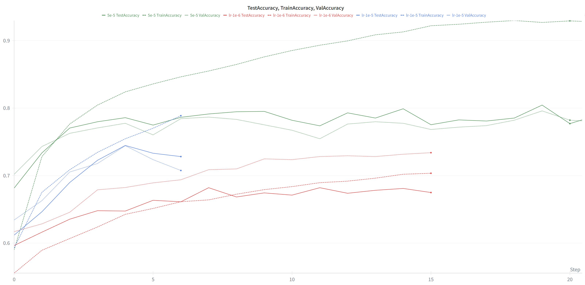

# Bert


## Pretaining

We reproduced the pattern shown at paper *Characterizing Learning Curves During Language Model Pre-Training: Learning, Forgetting, and Stability*:
> Althought the paper focuses on GPT-2, we do see similar phenomena in BERT pretraining.

1. "Early in pre-training, models generate short repetitive phrases."

We do see this phenomenon when we pretrain the BERT model on bookcorpus dataset, and the generated text looks like this:

```bash
Input Tokens: [CLS]|#|#|skyscr|##aper|arch|##ipe|##lag|##o|[SEP]|trying|to|recover|nuclear|weapons|now|[MASK]|[MASK]|bottom|[MASK]|the|ocean|.|.|.|.|[MASK]|were|trying|to|keep|a|nuclear|power|-|plant|from|melting|down|.|hait|.|.|[MASK]|high|[MASK]|ranking|officials|were|still|alive|at|the|submerged|un|compound|.|.|.|.|all|[MASK]|of|[SEP]
Target Tokens: skyscr|at|the|of|they|power|.|some|-|sorts
Predicted Tokens: .|.|.|.|.|.|.|.|.|.
```
We found at each step the model tends to predict the same token "."(or "the", "a", "and", ...) for all the masked positions.

2. "Models later generate longer and more coherent text."

After more training steps, the model can predict more meaningful tokens:

```bash
Input Tokens: [CLS]|"|never|mind|.|i|was|only|making|##ival|joke|familial|[MASK]|he|said|,|and|then|he|questioned|his|new|companion|.|"|i|don|'|t|feel|the|[MASK]|strap|anymore|.|how|is|it|that|i|delir|[MASK]|you|?|"|[SEP]|[MASK]|workers|be|sent|into|fields|for|the|harvest|.|the|very|next|verses|in|matthew|[MASK]|s|[MASK]|are|jesus|sending|out|the|apostles|to|do|the|exact|same|thing|he|had|been|[MASK]|(|matt|10|:|[MASK]|-|7|[MASK]|.|they|were|to|be|the|[MASK]|that|were|sent|out|to|gather|[MASK]|harvest|.|this|is|our|call|[MASK]|,|to|go|to|[MASK]|lost|,|hungry|and|thirsty|(|the|lost|sheep|of|this|[MASK]|[SEP]
Target Tokens: a|,|"|translator|anymore|can|understand|more|'|gospel|doing|matt|1|)|workers|the|too|the|age
[train]Predicted Tokens: a|,|"|same|anymore|can|about|more|'|gospel|born|matt|1|)|workers|the|too|the|age
```


## Finetune: W/O Pretraining on SST2

The SST2 dataset:

- train/validation dataset: [stanfordnlp/sst2](https://huggingface.co/datasets/stanfordnlp/sst2)
- test dataset: [SetFit/sst2](https://huggingface.co/datasets/SetFit/sst2)


The model architecture:

```python
class SST2BertModel(torch.nn.Module):
    def __init__(self, config: BertConfig) -> None:
        super().__init__()
        self.bert = Bert(config, padding_idx=bert_tokenizer.token_to_id("[PAD]"))
        self.classifier = torch.nn.Linear(config.d_model, 2)  # SST-2 has 2 classes

    def forward(self, input_ids: torch.Tensor, token_type_ids: torch.Tensor) -> torch.Tensor:
        bert_output = self.bert(input_ids, token_type_ids)
        cls_hidden_state = bert_output[:, 0, :]
        logits = self.classifier(cls_hidden_state)
        return logits
```


### Without Pretraining on SST2

The bert config(almost the same as base BERT):

> Note here we use a smaller `max_seq_length=128` while the original BERT uses `max_seq_length=512`.

```python
bert_config = BertConfig(
    max_seq_length=128,
    vocab_size=30522,
    d_model=768,
    attention_d_k=768,
    attention_d_v=768,
    head_num=12,
    d_feed_forward=3072,
    encoder_layers=12,
)
```

The training curve on SST2 dataset with different learning rates:




Observations:
- With a learning rate of `5e-5`, the model achieves best test accuracy of around 80%
- With learning rates of `1e-5` and `1e-6`, the model got worse performance
- All the learning rates lead to overfitting after several epochs


## The mistakes that I made


### Can not overfit even on a very small dataset

I want to make sure that the full pipeline(data loading, tokenization, model training) is working correctly and that the model can overfit on a small dataset before scaling up. To speed up the overfitting speed, I set a bigger learning rate(0.01/0.001). But I find I can not overfit even on a very small dataset.

I spend lots of time and try many ways to debug this:
- Recheck the data preparation
- Verify the model architecture
- Experiment with different hyperparameters
- Make sure the mask token is being used correctly
- ...

All of these tries did not help me to overfit the model on the small dataset.
You may wonder: can llm/ai helps? The answer is NOOOOOO! They just can't. And they point out MANY meaningless suggestions.
So I try to debug by with smaller dataset and adding more print statements in my code to understand what's going wrong.

I try to train with only ONE data sample and print all the related tensors (input, target, prediction) to see if they make sense.
Finally, I find this output:

```
====================================================================================================
Epoch 146/1000 - Train Loss: 2.3028, Train MLM Loss: 2.3028, Train NSP Loss: 0.0000, Train NSP Accuracy: 1.0000,
====================================================================================================
Input Tokens: [CLS]|#|#|skyscr|##aper|arch|##ipe|##lag|##o|[SEP]|trying|to|recover|nuclear|weapons|now|[MASK]|[MASK]|bottom|[MASK]|the|ocean|.|.|.|.|[MASK]|were|trying|to|keep|a|nuclear|power|-|plant|from|melting|down|.|hait|.|.|[MASK]|high|[MASK]|ranking|officials|were|still|alive|at|the|submerged|un|compound|.|.|.|.|all|[MASK]|of|[SEP]
Target Tokens: skyscr|at|the|of|they|power|.|some|-|sorts
Predicted Tokens: at|at|at|at|at|at|at|at|at|at
====================================================================================================
Epoch 147/1000 - Train Loss: 2.3028, Train MLM Loss: 2.3028, Train NSP Loss: 0.0000, Train NSP Accuracy: 1.0000,
====================================================================================================
Input Tokens: [CLS]|#|#|skyscr|##aper|arch|##ipe|##lag|##o|[SEP]|trying|to|recover|nuclear|weapons|now|[MASK]|[MASK]|bottom|[MASK]|the|ocean|.|.|.|.|[MASK]|were|trying|to|keep|a|nuclear|power|-|plant|from|melting|down|.|hait|.|.|[MASK]|high|[MASK]|ranking|officials|were|still|alive|at|the|submerged|un|compound|.|.|.|.|all|[MASK]|of|[SEP]
Target Tokens: skyscr|at|the|of|they|power|.|some|-|sorts
Predicted Tokens: some|some|some|some|some|some|some|some|some|some
====================================================================================================
```

And the loss is keep shake around 2.3(most mlm loss, the nsp loss is near 0.0).
The make me realize that the model maybe stuck in a local minimum, due to the **large learning rate**.
So I try with a smaller learning rate `0.0001` and then the training loss can decrease to 0.0, and the predicted tokens can finally match the target tokens:

```
====================================================================================================
Epoch 29/1000 - Train Loss: 0.0004, Train MLM Loss: 0.0000, Train NSP Loss: 0.0004, Train NSP Accuracy: 1.0000,
====================================================================================================
Input Tokens: [CLS]|#|#|skyscr|##aper|arch|##ipe|##lag|##o|[SEP]|trying|to|recover|nuclear|weapons|now|[MASK]|[MASK]|bottom|[MASK]|the|ocean|.|.|.|.|[MASK]|were|trying|to|keep|a|nuclear|power|-|plant|from|melting|down|.|reap|.|.|[MASK]|high|[MASK]|ranking|officials|were|still|alive|at|the|submerged|un|compound|.|.|.|.|all|[MASK]|of|[SEP]
Target Tokens: skyscr|at|the|of|they|power|.|some|-|sorts
Predicted Tokens: skyscr|at|the|of|they|power|.|some|-|sorts
====================================================================================================
Epoch 30/1000 - Train Loss: 0.0000, Train MLM Loss: 0.0000, Train NSP Loss: 0.0000, Train NSP Accuracy: 1.0000,
====================================================================================================
Input Tokens: [CLS]|#|#|skyscr|##aper|arch|##ipe|##lag|##o|[SEP]|trying|to|recover|nuclear|weapons|now|[MASK]|[MASK]|bottom|[MASK]|the|ocean|.|.|.|.|[MASK]|were|trying|to|keep|a|nuclear|power|-|plant|from|melting|down|.|reap|.|.|[MASK]|high|[MASK]|ranking|officials|were|still|alive|at|the|submerged|un|compound|.|.|.|.|all|[MASK]|of|[SEP]
Target Tokens: skyscr|at|the|of|they|power|.|some|-|sorts
Predicted Tokens: skyscr|at|the|of|they|power|.|some|-|sorts
====================================================================================================
```

> To speed up the overfitting speed, I set a bigger learning rate(0.01/0.001)

So that's the story: A bigger learning rate can help the model to converge faster, but it may also lead to local minima.

And, why am I so hurry to want to train the model faster? Because my 4060Ti GPU is so slow and want to finish the training as soon as possible. So, be patient man.

### Full dataset transformation at beginning

```python
def get_split_dataloader(
    dataset_path: str,
    split: str,
    config: BertConfig,
) -> DataLoader:
    raw_dataset = get_dataset(dataset_path, None, split)  # type: ignore[call-arg]
    pretrain_dataset = dataset_transform(raw_dataset, config)
    dataloader = torch.utils.data.DataLoader(
        pretrain_dataset.with_format(type="torch"),
        batch_size=config.batch_size,
        collate_fn=lambda batch: collate_fn(batch, bert_tokenizer),
    )
```

The `pretrain_dataset = dataset_transform(raw_dataset, config)` will transform the whole dataset at once, which is very time-consuming(with 12 CPUs( 2.1 GHz), which took more than 7 days...). It is better to do this transformation at training batch level.


### Use self-define buffer for DataLoader

To resolve the above problem, I try to use a self-defined buffer to store the transformed data samples, but it is still slow and not efficient. With this method, the GPU is often idle, waiting for the CPU to prepare the data.


I realized that I should not use a self-defined buffer(even it seems easy(It's actually not so that easy)), but rather use the built-in features of the `datasets` library and `DataLoader` to optimize data loading and transformation. The key changes are as fellows:

Instead of transforming the whole dataset at once, we can use the `streaming=True` feature of `datasets` library to load and transform the dataset on-the-fly during training. And we can shard the dataset to speed up the data loading:

```python
dataset = load_dataset(path=dataset_path, name=dataset_name, split=split, streaming=True)
...
raw_dataset = raw_dataset.shuffle(seed=42).to_iterable_dataset(num_shards=32)
```

Use `prefetch_factor` in DataLoader to speed up data loading:

> This method can solve the problem that the GPU is often idle, waiting for the CPU to prepare the data. But may introduce other problems, see the fellowing mistake for details.

```python
dataloader = torch.utils.data.DataLoader(
    pretrain_dataset.with_format(type="torch"),
    batch_size=config.batch_size,
    collate_fn=lambda batch: collate_fn(batch, bert_tokenizer),
    num_workers=16,
    prefetch_factor=10,
    pin_memory=True,
    persistent_workers=True,
)
```

### Use too many workers and too big prefetch factor for DataLoader

When I set `num_workers=16`(my CPU has 16 cores) and `prefetch_factor=10`,
the GPU never idle(keep brrrrrr), but the dataloader process memory usage is keep increasing and finally the system runs out of memory(OOM) and killed the process:
> The error occured after about 16 hours training and the memory usage beyond 16GB.

```python
File "/toynlp/.venv/lib/python3.12/site-packages/torch/nn/modules/linear.py", line 125, in forward
    return F.linear(input, self.weight, self.bias)
           ^^^^^^^^^^^^^^^^^^^^^^^^^^^^^^^^^^^^^^^
File "/toynlp/.venv/lib/python3.12/site-packages/torch/utils/data/_utils/signal_handling.py", line 73, in handler
    _error_if_any_worker_fails()
RuntimeError: DataLoader worker (pid 2972) is killed by signal: Killed.
```

I try to solve this problem by reducing the `num_workers` and `prefetch_factor` and remove the `pin_memory` and `persistent_workers` options:

```python
dataloader = torch.utils.data.DataLoader(
    pretrain_dataset.with_format(type="torch"),
    batch_size=config.batch_size,
    collate_fn=lambda batch: collate_fn(batch, bert_tokenizer),
    num_workers=8,
    prefetch_factor=4,
)
```

The training is going on and I don't know if this problem will happen again.
I find both [pytorch/issues/13246](https://github.com/pytorch/pytorch/issues/13246)
and [datasets/issues/7269](https://github.com/huggingface/datasets/issues/7269) have
memory leak problems in a way or another, but I am not sure if my problem is caused by these issues.


## References
- [google-research/bert](https://github.com/google-research/bert)
- [codertimo/BERT-pytorch](https://github.com/codertimo/BERT-pytorch)
- [dreamgonfly/BERT-pytorch](https://github.com/dreamgonfly/BERT-pytorch)
